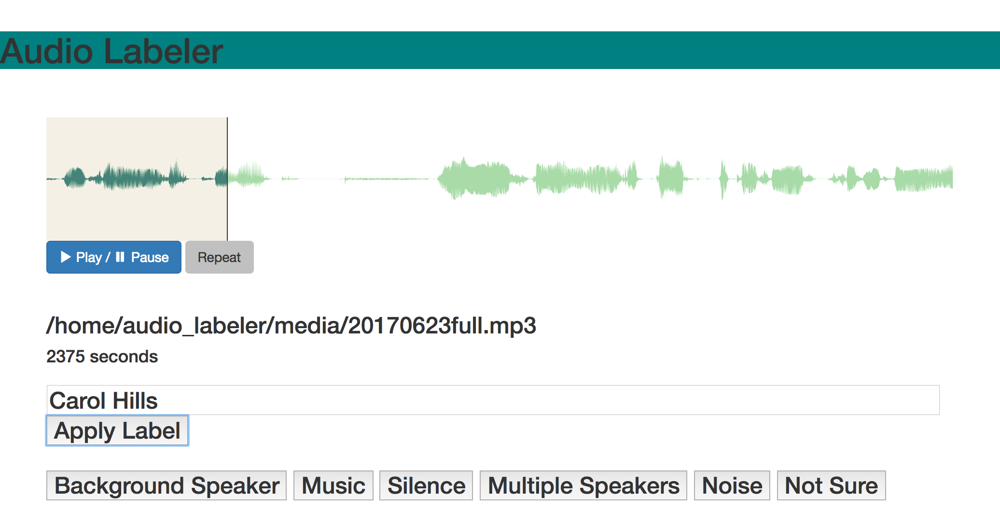

### *Running Audio Labeler*

First, install [Docker CE](https://www.docker.com/community-edition) or [Docker Toolbox](https://www.docker.com/products/docker-toolbox).

Open a new terminal window and enter the following commands to kill the current Docker container (if running), then download and launch the latest container build.

```
docker rm -f audio_labeler

docker pull hipstas/audio-labeler

docker run -it -d --name audio_labeler -p 8000:8000 -v ~/Desktop/audio_labeler:/home/audio_labeler hipstas/audio-labeler bash
```
Move some audio files (MP3 or WAV) into the newly created folder `~/Desktop/audio_labeler/media/`. The application will recursively find files in subdirectories. All filenames should be unique to avoid ambiguity down the line.

In the terminal, re-enter the following three commands to relaunch the Audio Labeler application. Audio files are only detected when the Flask application is launched.

```
docker rm -f audio_labeler

docker pull hipstas/audio-labeler

docker run -it -d --name audio_labeler -p 8000:8000 -v ~/Desktop/audio_labeler:/home/audio_labeler hipstas/audio-labeler bash
```

Point your browser to `localhost:8000` and begin labeling. Audio Labeler is currently configured to label 1-second clips chosen at random from a provided audio collection. (At the moment I'm  not weighting my selection based on each file's duration.)

The 1-second clip we're labeling will autoplay each time the page loads, and is shaded in the waveform display. The following 4 seconds are provided for context if needed.

Enter your label by hand and click `Apply Label`, or choose from the included options. For convenience, a label in the text box will persist from one page to the next. The `Apply Label` button is highlighted on page load, so you can quickly apply the contents of the text box by pressing return.

The top 5 most used labels in the current session will appear as dedicated buttons at the bottom of the page, ordered by how often they have been used.

The application will output all label data to the file `output_table.csv` in the `audio_labeler` directory. You can download the current CSV at any time using the link provided in the browser interface.

Each label is written as a new row to the end of `output_table.csv`, so you can safely edit the CSV while you work and resume where you left off when you relaunch the Docker container.

If you delete `output_table.csv` or change its name, a new one will be created next time you apply a label through the browser interface. I recommend [LibreOffice](https://www.libreoffice.org/) for editing CSVs without mangling them.
